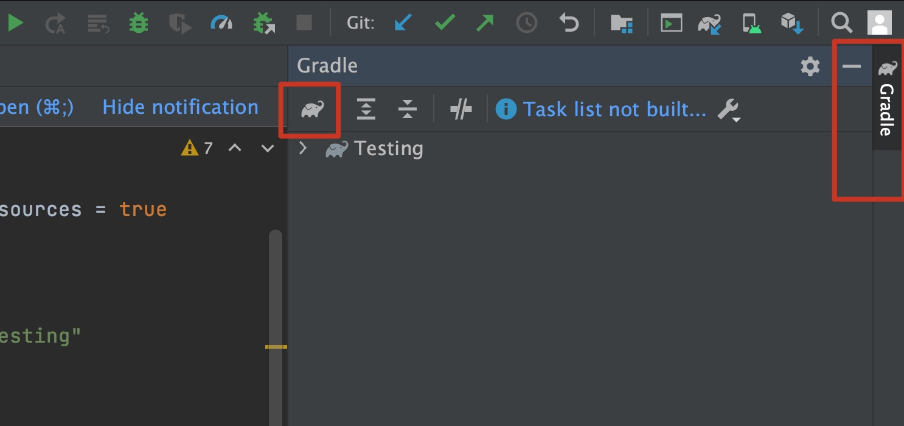
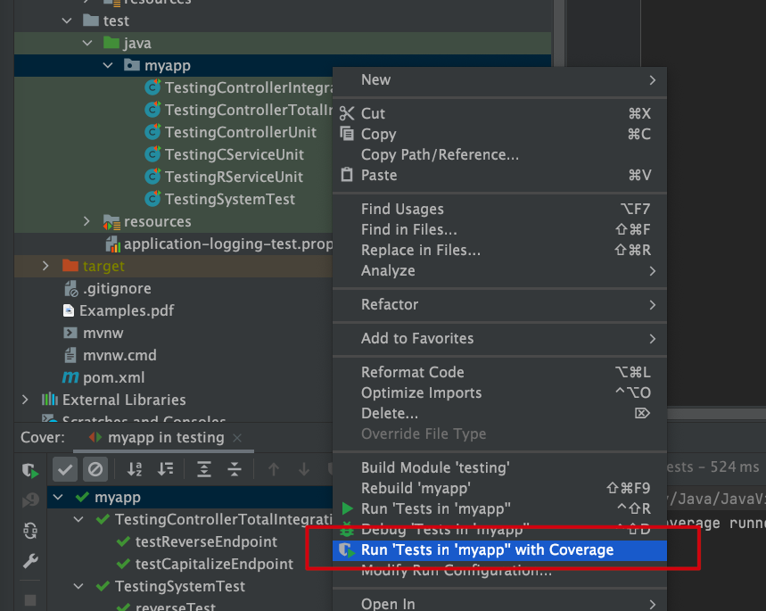
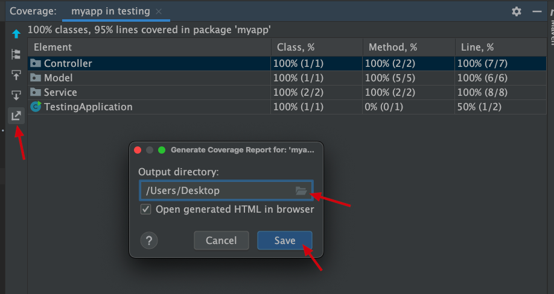
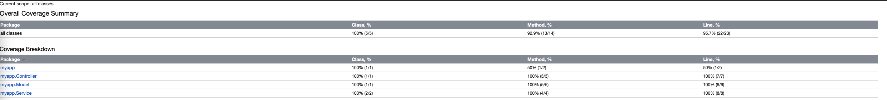

SpringBoot version 3.1.4
JAVA JDK version 11
Android compileSdkVersion 31

# Which files for system tests

#### Backend: `Backend->testing->src->test->java->myapp->TestingSystemTest.java`

#### Frontend: `Testing->app->src->androidTest->java->com->cs309->testing->SystemTest.java`

## Note

In the above example, the backend must be running for frontend tests to pass.

# Frontend Coverage Report

1. add to your `build.gradle(Module: app)` (inside buildTypes)
```
debug{
    testCoverageEnabled true
}
```
so that it looks like this 
```
 buildTypes {
    debug{
        testCoverageEnabled true
    }

    ... (other things)
}
```

2. click on `sync now` to update the project

3. make sure you have your Android enmulator up and running

4. in Android Studio, open Gradle tab on the right, hit the 'Gradle icon' to type in commands



5. type in `createDebugCoverageReport` and hit 'Enter'


6. once it runs through, find the coverage report in: `/tutorials/Frontend/Testing/app/build/reports/coverage/androidTest/debug/index.html`

7. it should look something like:


[source](https://stackoverflow.com/questions/33393871/how-to-obtain-coverage-for-android-project-using-espresso-tests)


# Backend Coverage Report

1. in IntelliJ -> project structure, right click on the test directory

2. run all tests with coverage



3. save the coverage report to a directory



4. expect to get a similar example to the following:



[source](https://www.jetbrains.com/help/idea/generating-code-coverage-report.html)
